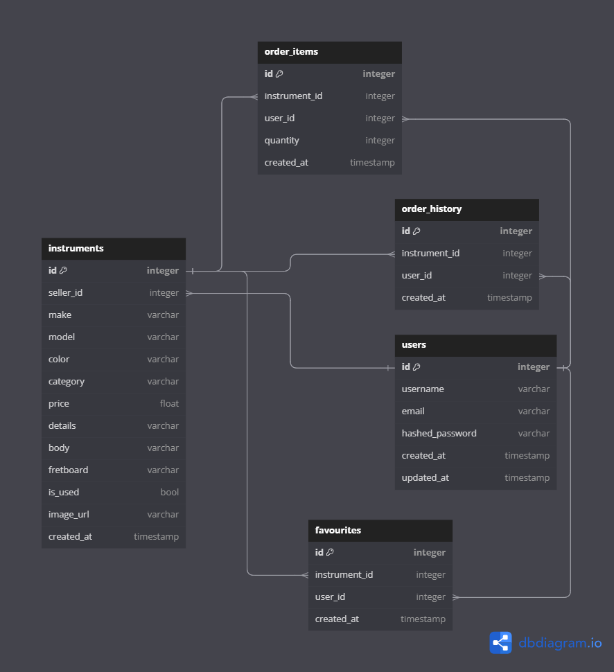

# RIFF HARBOR
  - Welcome to Riff Harbor – your premier destination for all things music! Our mission is to assist you in discovering the ideal instrument that perfectly complements your individual style and sonic expression. Let us guide you as you embark on your musical journey.

## URL
my url

## Data Schema


## Features
  - Shopping (Orders & Checkout) 
  - Instruments
  - Search box

# Endpoints
## USERS
### Get the Current User

Returns the information about the current user that is logged in.

* Require Authentication: false
* Request
  * Method: GET
  * URL: /api/auth
  * Body: none

* Successful Response when there is a logged in user
  * Status Code: 200
  * Headers:
    * Content-Type: application/json
  * Body:

    ```json
      {
        "user": {
          "id": 1,
          "email": "john1.smith@gmail.com",
          "username": "JohnSmith,"
        }
      }
    ```

* Successful Response when there is no logged in user
  * Status Code: 200
  * Headers:
    * Content-Type: application/json
  * Body:

    ```json
      {
        "user": null
      }
    ```

### Log In a User

Logs in a user with valid credentials and returns the current user's
information.

* Require Authentication: false
* Request
  * Method: POST
  * URL: /api/auth/login
  * Headers:
    * Content-Type: application/json
  * Body:

    ```json
      {
        "email": "john1.smith@gmail.com",
        "password": "password"
      }
    ```

* Successful Response
  * Status Code: 200
  * Headers:
    * Content-Type: application/json
  * Body:

    ```json
      {
        "user": {
          "id": 1,
          "email": "john1.smith@gmail.com",
          "username": "JohnSmith,"
        }
      }
    ```

* Error response: Inccorect Password
  * Status code: 401
  * Headers:
    * Content-Type: application/json
  * Body:

    ```json
      {
        "password": [
          "Password was incorrect."
        ]
      }
    ```

* Error response: Bad request
  * Status Code: 400
  * Headers:
    * Content-Type: application/json
  * Body:

    ```json
      {
        "email": [
          "This field is required" || "Email provided not found."
        ],
        "password": [
          "This field is required" || "Password was incorrect."
        ]
      }
    ```

### Log Out a User

Logs out the current user, ending their session.

* Require Authentication: True
* Request
  * Method: GET
  * URL: /api/auth/logout
  * Body: None

* Successful Response
  * Status Code: 200
  * Headers:
    * Content-Type: application/json
  * Body:

    ```json
      {
        "message": "User logged out"
      }
    ```


### Sign Up a User

Creates a new user, logs them in as the current user, and returns the current user's information.

* Require Authentication: false
* Request
  * Method: POST
  * URL: /api/auth/signup
  * Headers:
    * Content-Type: application/json
  * Body:

    ```json
      {
        "email": "john1.smith@gmail.com",
        "username": "JohnSmith",
        "password": "password"
      }
    ```

* Successful Response
  * Status Code: 200
  * Headers:
    * Content-Type: application/json
  * Body:

    ```json
      {
        "user": {
          "id": 1,
          "email": "john1.smith@gmail.com",
          "username": "JohnSmith,"
        }
      }
    ```

* Error response: User already exists with the specified email or username
  * Status Code: 400
  * Headers:
    * Content-Type: application/json
  * Body:

    ```json
    {
      "email": [
        "Email address is already in use."
      ],
      "username": [
        "Username is already in use."
      ]
    }
    ```

* Error response: Body validation errors
  * Status Code: 400
  * Headers:
    * Content-Type: application/json
  * Body:

    ```json
      {
        "email": [
          "This field is required" || "Email is invalid."
        ],
        "password": [
          "This field is required" || "Password must be at least 6 characters."
        ],
        "username": [
          "This field is required" || "Username must be at least 4 characters."
        ]
      }
    ```


## Instruments
### Get all instruments
* Require Authentication: False
* Request
  * Method: GET
  * URL: /api/instruments
  * Body: None

* Successful Response
  * Status Code: 200
  * Headers:
    * Content-Type: application/json
  * Body:

    ```json
      {
        "Products": [
          {
            "id": 1,
            "seller_id": 1,
            "model": "Fender American Vintage II 1951 Telecaster",
            "color": "Butterscotch Blonde",
            "category": "Electric Guitar",
            "price": 2449.99,
            "details": "The Fender American Vintage II 1951 Telecaster is a premium electric guitar, meticulously crafted to capture the essence of the original 1951 Telecaster. With its vintage style and iconic sound, it's a true tribute to Fender's historic legacy.",
            "body": "Maple",
            "fingerBoard": "Maple",
            "make": "Fender",
            "is_used": false,
            "image_url": "url.png",
            "createdAt": "2024-01-20 20:00:00",
            "updatedAt": "2024-01-20 20:20:20",
          }
        ]
      }
    ```


### Get all instruments posted by current user
* Require Authentication: True
* Request
  * Method: GET
  * URL: /api/instruments/current
  * Body: None

* Successful Response
  * Status Code: 200
  * Headers:
    * Content-Type: application/json
  * Body:

    ```json
      {
        "Products": [
          {
            "id": 1,
            "seller_id": 1,
            "model": "Fender American Vintage II 1951 Telecaster",
            "color": "Butterscotch Blonde",
            "category": "Electric Guitar",
            "price": 2449.99,
            "details": "The Fender American Vintage II 1951 Telecaster is a premium electric guitar, meticulously crafted to capture the essence of the original 1951 Telecaster. With its vintage style and iconic sound, it's a true tribute to Fender's historic legacy.",
            "body": "Maple",
            "fingerBoard": "Maple",
            "make": "Fender",
            "is_used": false,
            "image_url" : "img.png"
            "createdAt": "2024-01-20 20:00:00",
            "updatedAt": "2024-01-20 20:20:20",
          }
        ]
      }
    ```
* Error response: Couldn't find a instrument with the specified id
  * Status Code: 404
  * Headers:
    * Content-Type: application/json
  * Body:


### Get a instrument by id
* Require Authentication: True
* Request
  * Method: GET
  * URL: /api/instruments/:instrumentId
  * Body: None

* Successful Response
  * Status Code: 200
  * Headers:
    * Content-Type: application/json
  * Body:

    ```json
      {
        "id": 1,
        "seller_id": 1,
        "model": "Fender American Vintage II 1951 Telecaster",
        "color": "Butterscotch Blonde",
        "category": "Electric Guitar",
        "price": 2449.99,
        "details": "The Fender American Vintage II 1951 Telecaster is a premium electric guitar, meticulously crafted to capture the essence of the original 1951 Telecaster. With its vintage style and iconic sound, it's a true tribute to Fender's historic legacy.",
        "body": "Maple",
        "fingerBoard": "Maple",
        "make": "Fender",
        "is_used": false,
        "image_url" : "img.png"
        "createdAt": "2024-01-20 20:00:00",
        "updatedAt": "2024-01-20 20:20:20",
      }
    ```

* Error response: Product not found
  * Status Code: 404
  * Headers:
    * Content-Type: application/json
  * Body:

    ```json
      {
        "message": "Product couldn't be found"
      }
    ```

### Create a instrument
* Require Authentication: True
* Request
  * Method: POST
  * URL: /api/instruments/new
  * Body:
    ```json
      {
        "model": "Fender American Ultra Stratocaster HSS",
        "color": "Arctic Pearl",
        "category": "Electric Guitar",
        "price": 2249.99,
        "details": "Iconic for 60+ years, the Fender American Ultra Strat HSS offers precision, performance, and tone. Modern design, Ultra Noiseless pickups, and versatile sound.",
        "body": "Alder",
        "fingerBoard": "Maple",
        "make": "Fender",
        "is_used": true,
        "image_url" : "img.png"
      }
    ```

* Successful Response
  * Status Code: 200
  * Headers:
    * Content-Type: application/json
  * Body:

    ```json
      {
        "id": 2,
        "seller_id": 1,
        "model": "Fender American Ultra Stratocaster HSS",
        "color": "Arctic Pearl",
        "category": "Electric Guitar",
        "price": 2249.99,
        "details": "Iconic for 60+ years, the Fender American Ultra Strat HSS offers precision, performance, and tone. Modern design, Ultra Noiseless pickups, and versatile sound.",
        "body": "Alder",
        "fingerBoard": "Maple",
        "make": "Fender",
        "is_used": true,
        "image_url" : "img.png",
        "createdAt": "2024-01-20 20:00:00",
        "updatedAt": "2024-01-20 20:20:20",
      }
    ```

* Error response: Body validation errors
  * Status Code: 400
  * Headers:
    * Content-Type: application/json
  * Body:

    ```json
      {
        "model": [
          "This field is required." || "Model must be under 100 characters"
        ],
        "color": [
          "This field is required." || "Color must be under 50 characters"
        ],
        "category": [
          "This field is required." || "Category must be one of the following: Electric Guitar, Acoustic Guitar, Bass, Drum, Amp, or Accessories."
        ],
        "price": [
          "This field is required." || "Price must be greater than 0"
        ],
        "details": [
          "This field is required." || "Details must be greater than 25 characters"
        ],
        "body": [
          "This field is required." || "Details must be under 25 characters"
        ],
        "fingerBoard": [
          "This field is required." || "Details must be under 25 characters"
        ],
        "make": [
          "This field is required." || "Details must be under 25 characters"
        ],
        "used": [
          "This field is required."
        ],
        "image_url": [
          "This field is required."
        ]
      }
    ```

### Update a instrument
* Require Authentication: True
* Request
  * Method: PUT
  * URL: /api/instruments/:instrumentId/update
  * Body:
    ```json
      {
        "model": "Fender American Ultra Stratocaster HSS NEW!",
        "color": "Arctic Pearl",
        "category": "Electric Guitar",
        "price": 3339.99,
        "details": "Iconic for 60+ years, the Fender American Ultra Strat HSS offers precision, performance, and tone. Modern design, Ultra Noiseless pickups, and versatile sound.",
        "body": "Alder",
        "fingerBoard": "Maple",
        "make": "Fender",
        "is_used": false,
        "image_url" : "img.png"
      }
    ```

* Successful Response
  * Status Code: 200
  * Headers:
    * Content-Type: application/json
  * Body:

    ```json
      {
        "id": 2,
        "seller_id": 1,
        "model": "Fender American Ultra Stratocaster HSS",
        "color": "Arctic Pearl",
        "category": "Electric Guitar",
        "price": 2249.99,
        "details": "Iconic for 60+ years, the Fender American Ultra Strat HSS offers precision, performance, and tone. Modern design, Ultra Noiseless pickups, and versatile sound.",
        "body": "Alder",
        "fingerBoard": "Maple",
        "make": "Fender",
        "is_used": true,
        "image_url" : "img.png",
        "createdAt": "2024-01-20 20:00:00",
        "updatedAt": "2024-01-20 20:20:20",
      }
    ```

* Error response: Instrument not found
  * Status Code: 404
  * Headers:
    * Content-Type: application/json
  * Body:

    ```json
      {
        "message": "Instrument couldn't be found"
      }
    ```

* Error response: Body validation errors
  * Status Code: 400
  * Headers:
    * Content-Type: application/json
  * Body:

    ```json
      {
        "model": [
          "This field is required." || "Model must be under 100 characters"
        ],
        "color": [
          "This field is required." || "Color must be under 50 characters"
        ],
        "category": [
          "This field is required." || "Category must be one of the following: Electric Guitar, Acoustic Guitar, Bass, Drum, Amp, or Accessories."
        ],
        "price": [
          "This field is required." || "Price must be greater than 0"
        ],
        "details": [
          "This field is required." || "Details must be greater than 25 characters"
        ],
        "body": [
          "This field is required." || "Details must be under 25 characters"
        ],
        "fingerBoard": [
          "This field is required." || "Details must be under 25 characters"
        ],
        "make": [
          "This field is required." || "Details must be under 25 characters"
        ],
        "used": [
          "This field is required."
        ],
        "image_url": [
          "This field is required."
        ]
      }
    ```

### Delete a instrument by id

Delete an existing instrument by id.

* Require Authentication: True
* Require Authorization: True. (Must be the seller of the instrument)
* Request
  * Method: DELETE
  * URL: /api/instrument/:instrumentId/delete
  * Body: None

* Successful Response
  * Status Code: 200
  * Headers:
    * Content-Type: application/json
  * Body:

    ```json
      {
        "message": "Successfully deleted instrument"
      }
    ```

* Error response: Product not found
  * Status Code: 404
  * Headers:
    * Content-Type: application/json
  * Body:

    ```json
      {
        "message": "Instrument couldn't be found"
      }
    ```

## Order List
### Get all orders (current orders and previous orders) for the current user
* Require Authentication: True
* Request
  * Method: GET
  * URL: /api/orderLists
  * Body: None

* Successful Response
  * Status Code: 200
  * Headers:
    * Content-Type: application/json
  * Body:

    ```json
      {
        "AllOrderLists": [
        {
          "id": 1,
          "customer_id": 1,
          "hasCheckedOut": false,
          "Items": [
            {
              "id": 2,
              "order_list_id": 2,
              "instrument_id": 3,
              "orderQuantity": 1
            },
            {
              "id": 3,
              "order_list_id": 2,
              "instrument_id": 4,
              "orderQuantity": 2
            }
          ],
          "createdAt": "2024-01-20 20:00:00",
          "updatedAt": "2024-01-20 20:20:20",
        }, {
          "id": 2,
          "customer_id": 1,
          "hasCheckedOut": true,
          "Items": [
            {
              "id": 1,
              "order_list_id": 1,
              "instrument_id": 1,
              "orderQuantity": 1
            }
          ],
          "createdAt": "2024-01-20 20:00:00",
          "updatedAt": "2024-01-20 20:20:20",
        }
        ]
      }
    ```


### Get an order list (current orders or previous orders) by id
* Require Authentication: True
* Request
  * Method: GET
  * URL: /api/orderLists/:orderListId
  * Body: None

* Successful Response
  * Status Code: 200
  * Headers:
    * Content-Type: application/json
  * Body:

    ```json
      {
        "id": 1,
        "customer_id": 1,
        "hasCheckedOut": false,
        "Items": [
          {
            "id": 2,
            "order_list_id": 2,
            "instrument_id": 3,
            "orderQuantity": 1
          },
          {
            "id": 3,
            "order_list_id": 2,
            "instrument_id": 4,
            "orderQuantity": 2
          }
        ],
        "createdAt": "2024-01-20 20:00:00",
        "updatedAt": "2024-01-20 20:20:20",
      }
    ```

* Error response: Order List not found
  * Status Code: 404
  * Headers:
    * Content-Type: application/json
  * Body:

    ```json
      {
        "message": "Order List couldn't be found"
      }
    ```

### Create an order lists (cerate an empty cart for the user)
* Require Authentication: True
* Request
  * Method: POST
  * URL: /api/orderLists
  * Body: None

* Successful Response
  * Status Code: 200
  * Headers:
    * Content-Type: application/json
  * Body:

    ```json
      {
        "id": 1,
        "customer_id": 1,
        "hasCheckedOut": false,
        "Items": []
        "createdAt": "2024-01-20 20:00:00",
        "updatedAt": "2024-01-20 20:20:20",
      }
    ```

* Error response: Only allows user to have one cart
  * Status Code: 500
  * Headers:
    * Content-Type: application/json
  * Body:

    ```json
      {
        "message": "Please checkout or clear your previous cart"
      }
    ```


### Update the current order (already in the cart) in the order lists
* Require Authentication: True
* Request
  * Method: PUT
  * URL: /api/orderLists/:orderList
  * Body:
    ```json
      {
        "instrument_id": 4,
        "orderQuantity": 3
      }
    ```

* Successful Response (when order quantity is greater than 0)
  * Status Code: 200
  * Headers:
    * Content-Type: application/json
  * Body:

    ```json
      {
        "id": 3,
        "order_list_id": 2,
        "instrument_id": 4,
        "orderQuantity": 3,
        "createdAt": "2024-01-20 20:00:00",
        "updatedAt": "2024-01-20 20:20:20",
      }
    ```

* Successful Response (when order quantity equals to 0 => deleting the item)
  * Status Code: 200
  * Headers:
    * Content-Type: application/json
  * Body:

    ```json
      {
        "message": "Successfully removed order item from cart"
      }
    ```

* Error response: Order List not found
  * Status Code: 404
  * Headers:
    * Content-Type: application/json
  * Body:

    ```json
      {
        "message": "Order couldn't be found"
      }
    ```
* Error response: Order item body validation
  * Status Code: 400
  * Headers:
    * Content-Type: application/json
  * Body:

    ```json
      {
        "instrument_id": [
          "This field is required."|| "Instrument Id must be a valid positive integer"
        ],
        "orderQuantity": [
          "This field is required."|| "Order quantity Id must be 1 when you first add it to cart"
        ]
      }
    ```

### Checkout
* Require Authentication: True
* User authentication: Current user must own the order list
* Request
  * Method: GET
  * URL: /api/orderLists/:orderList/checkout
  * Body: None

* Successful Response
  * Status Code: 200
  * Headers:
    * Content-Type: application/json
  * Body:

    ```json
      {
        "message": "Successfully checkout"
      }
    ```

* Error response: Order List not found
  * Status Code: 404
  * Headers:
    * Content-Type: application/json
  * Body:

    ```json
      {
        "message": "Order couldn't be found"
      }
    ```
* Error response: Order List is empty
  * Status Code: 400
  * Headers:
    * Content-Type: application/json
  * Body:

    ```json
      {
        "message": "There's nothing in your cart"
      }
    ```


